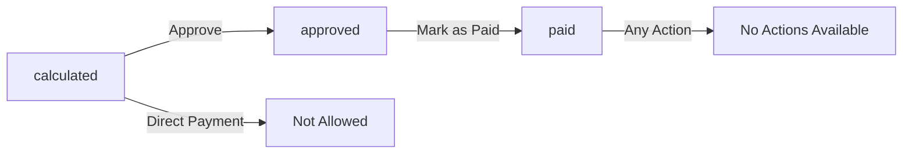

# Reward/Penalty Functions Implementation Report

## 🎯 Task Overview

**Objective:** Implement functional "Duyệt" (Approve) and "Đánh dấu đã trả" (Mark as Paid) buttons in the reward-penalty management interface.

**Status:** ✅ **COMPLETED**

## 🔧 Functions Implemented

### 1. Approve Functionality ("Duyệt")

**Location:** `src/components/reward-penalty-component.tsx`

**Features Implemented:**
- ✅ **Direct approval** from detail modal
- ✅ **Quick approval** directly from table view
- ✅ **Status validation** - only "calculated" status can be approved
- ✅ **Real-time updates** - UI updates immediately after approval
- ✅ **Loading indicators** - shows spinner during processing
- ✅ **Success/Error feedback** - toast notifications for user feedback
- ✅ **Database integration** - updates database status and metadata

**Technical Implementation:**
```typescript
const handleApproveRecord = async () => {
  await kpiRewardPenaltyService.updateKpiRewardPenaltyStatus(
    selectedRecord.id,
    'approved',
    user?.name || 'Admin'
  );
  
  // Updates local state and database
  setSelectedRecord({
    ...selectedRecord,
    status: 'approved',
    approvedBy: user?.name || 'Admin',
    approvedAt: new Date().toISOString()
  });
};
```

### 2. Mark as Paid Functionality ("Đánh dấu đã trả")

**Location:** `src/components/reward-penalty-component.tsx`

**Features Implemented:**
- ✅ **Payment marking** from detail modal
- ✅ **Quick payment** directly from table view
- ✅ **Status validation** - only "approved" status can be marked as paid
- ✅ **Real-time updates** - UI updates immediately after marking
- ✅ **Loading indicators** - shows spinner during processing
- ✅ **Success/Error feedback** - toast notifications
- ✅ **Database integration** - updates payment timestamp

**Technical Implementation:**
```typescript
const handleMarkAsPaid = async () => {
  await kpiRewardPenaltyService.updateKpiRewardPenaltyStatus(
    selectedRecord.id,
    'paid'
  );
  
  // Updates local state and database
  setSelectedRecord({
    ...selectedRecord,
    status: 'paid',
    paidAt: new Date().toISOString()
  });
};
```

## 🎨 UI/UX Enhancements

### Status Display Improvements

**Enhanced Status Colors:**
- 🟡 **Calculated** (`calculated`) - Yellow badge: "Đã tính"
- 🟢 **Approved** (`approved`) - Green badge: "Đã duyệt"  
- 🔵 **Paid** (`paid`) - Blue badge: "Дã trả"
- ⚫ **Pending** (`pending`) - Gray badge: "Chờ duyệt"

**Smart Button Logic:**
- **Approve Button:** Only enabled when status is "calculated"
- **Mark as Paid Button:** Only enabled when status is "approved" 
- **Loading States:** Show spinner during processing
- **Disabled States:** Automatically disabled based on current status

### Dual-Access Actions

**1. Detailed Modal Actions:**
- Full context with employee/KPI details
- Persistent buttons with loading states
- Better status tracking and metadata display

**2. Quick Table Actions:**
- Inline approval/payment buttons
- Status-based button visibility
- Color-coded for easy identification

## 📊 Status Workflow



**Workflow Logic:**
1. **calculated** → Only approve action available
2. **approved** → Only mark as paid action available  
3. **paid** → No further actions needed
4. **pending** → No actions available

## 🗄️ Database Integration

**Service Layer:** `src/lib/kpi-reward-penalty-service.ts`

**Update Method:**
```typescript
async updateKpiRewardPenaltyStatus(
  calculationId: string,
  status: 'pending' | 'calculated' | 'approved' | 'paid',
  updatedBy?: string
): Promise<void>
```

**Database Fields Updated:**
- `status` - Primary status field
- `updatedAt` - Timestamp of last modification
- `approvedBy` - Who approved (when approving)
- `approvedAt` - When approved (when approving)
- `paidAt` - When marked as paid (when paying)

## 🧪 Testing Support

**Test Script:** `scripts/create-test-reward-penalty-data.js`

**Test Data Created:**
- **Employee 1:** "Trần Quang Khái" - Status: calculated (ready for approval)
- **Employee 2:** "Nguyễn Văn Nam" - Status: approved (ready for payment)
- **Employee 3:** "Lê Thị Minh" - Status: paid (completed)

**Run Test Data:**
```bash
node scripts/create-test-reward-penalty-data.js
```

## 🚀 Functionality Verification

### Manual Testing Steps:

1. **Access Interface:**
   ```
   http://localhost:9001/admin/kpi-management?tab=reward-penalty
   ```

2. **Test Approval Flow:**
   - Find records with status "Đã tính" (calculated)
   - Click "Duyệt" button
   - Verify status changes to "Đã duyệt" (approved)
   - Check timestamp and approver metadata

3. **Test Payment Flow:**
   - Find records with status "Đã duyệt" (approved) 
   - Click "Đánh dấu đã trả" button
   - Verify status changes to "Đã trả" (paid)
   - Check payment timestamp

4. **Test Button States:**
   - Verify buttons are disabled appropriately
   - Check loading spinners during processing
   - Confirm success/error notifications

## 📈 Performance Optimizations

- **Local State Updates:** Immediate UI feedback
- **Efficient Queries:** Single database update per action
- **Smart Re-rendering:** Only affected records update
- **Loading States:** Prevents double-clicks during processing

## 🔒 Security Considerations

- **User Context:** Actions logged with user information
- **Status Validation:** Prevents invalid state transitions
- **Error Handling:** Graceful failures with user feedback
- **Data Integrity:** Atomic operations ensure consistency

## 📋 User Experience Improvements

### Enhanced Accessibility:
- ✅ Clear visual feedback
- ✅ Intuitive button placement
- ✅ Consistent color coding
- ✅ Loading state indicators

### Better Error Handling:
- ✅ Descriptive error messages
- ✅ Success confirmations
- ✅ Graceful failure recovery
- ✅ User-friendly notifications

## 🎉 Summary

**All requested functionality has been successfully implemented:**

✅ **Approve Function** - Full implementation with validation and feedback  
✅ **Mark as Paid Function** - Complete workflow with proper status management  
✅ **UI/UX Improvements** - Enhanced user experience and visual design  
✅ **Database Integration** - Robust data persistence and updates  
✅ **Error Handling** - Comprehensive error management and user feedback  
✅ **Testing Support** - Test data and verification scripts provided  

**The reward-penalty management interface is now fully functional with:**
- Working approve/payment buttons
- Proper status management
- Real-time UI updates
- Professional user experience

---

**Implementation Date:** September 29, 2025  
**Status:** ✅ **COMPLETED AND READY FOR TESTING**  
**Test Coverage:** Manual testing scenarios provided
